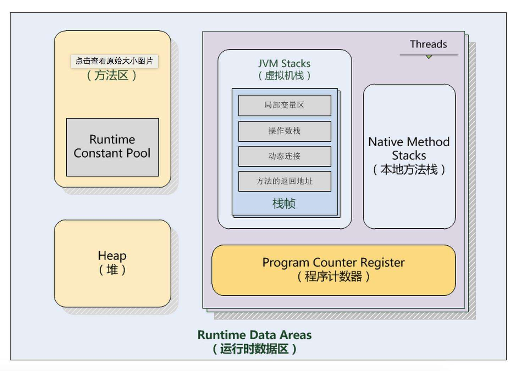

### JVM 内存分哪几个区，每个区的作用是什么(内存模型):star:
* 方法区（`线程共享`）：有时候也称为永久代（Java8开始废弃永久代，改名为元空间MetaSpace），在该区内很少发生垃圾回收，但是并不代表不发生GC，在这里的GC主要是对方法区里的常量池和对类型的卸载；方法区主要用来存储已被虚拟机加载的类的信息、常量、静态变量和即时编译器编译后的代码等数据；方法区里有一个运行时常量池，用于存放静态编译产生的字面量和符号的引用。
* 栈（`线程私有`，生命周期和线程相同）：为Java方法服务，每个方法在执行的时候都会创建一个栈帧，用于存储局部变量表、操作数栈、动态链接和方法出口等信息。
* 本地方法栈（`线程私有`）：本地方法栈和虚拟机栈类似，只不过本地方发栈为Native方法服务。
* 堆（`线程共享`）：Java堆是所有线程所共享的一块内存，是Java虚拟机管理内存最大的一块区域，在虚拟机启动时创建，几乎所有的对象实例都在这里创建，因为该区域经常发生垃圾回收操作。
* 程序计数器（`线程私有`，也叫PC寄存器）：程序计数器是一块很小的内存空间，它可以看作是当前线程所执行的字节码行号指示器，记住下一条JVM指令的执行地址指向下一条要执行的指令，不会存在内存溢出（唯一没有OutOfMemoryError的区域）
### 什么是类的加载
类的加载指的是将类的.class文件中的二进制数据读到内存中，将其放在运行时数据区的方法区内，然后在堆区创建一个java.lang.Class对象，用来封装类在方法区内的数据结构。
### 常用参数
* -Xms 初始化堆空间大小
* -Xmx 最大堆空间大小
* -Xmn 年轻代空间大小
* -Xss 栈空间大小
### JVM有哪些垃圾回收算法
* 标记清除：标记无用对象，然后进行清除回收；缺点：效率不高，无法清除垃圾碎片。
* 标记整理：标记无用对象，让所有存活的对象都向一端移动，然后直接清除掉端边界以外的内存。
* 复制：按照容量划分两个大小相等的内存区域，当一块用完的时候活着的对象复制到另一块上，然后把已使用的内存空间一次性清理掉；缺点：内存利用率低
* 分代算法：根据对象存活周期的不同将内存划分为几块，一般是新生代和老年代，新生代基本采用复制算法，老年代采用标记整理算法。
### 什么是双亲委派模型
如果一个类加载器收到了类加载的请求，它首先不会自己去加载这个类，而是把这个请求委派给父类加载器去完成，只有当父加载无法完成加载请求（它的搜索范围中没找到所需的类）时，子加载器才会去尝试加载类。
### 怎么判断对象是否可以被回收
* 引用计数器：为每个对象创建一个引用计数器，有对象引用时计数器+1，引用被释放时计数-1，当计数器为0时就可以被回收；缺点：不能解决循环引用的问题
* 可达性分析：从GC Roots开始向下搜索，搜索所走过的路径称为引用链；当一个对象到GC Roots没有任何引用链接时，则证明此对象是可以被回收的。
### 累加载的过程
加载➔验证➔准备➔解析➔初始化➔使用➔卸载
