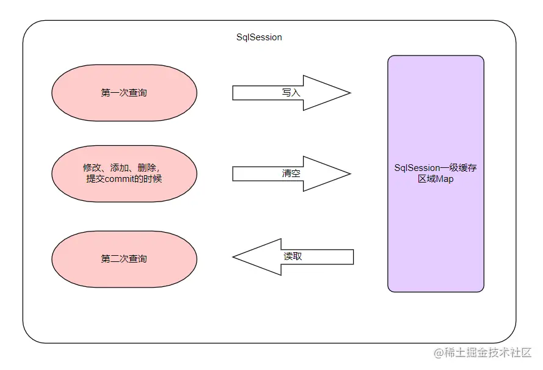
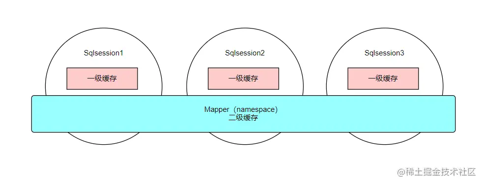

### $符号和#号的区别
* #{变量名}可以进行预编译、类型匹配等操作、会转化为jdbc的类型、能够很大程度防止SQL注入。
* ${变量名}不进行数据类型匹配，直接替换、不会防止SQL注入。

### 缓存
* 一级缓存：是SqlSession级别的缓存；在操作数据库时需要构造SqlSession对象，在对象中有一个数据结构（HashMap）用于存储缓存数据；不同的SqlSession之间的缓存数据区（HashMap）是互相不影响。

* 二级缓存：是Mapper级别的缓存，多个SqlSession去操作同一个Mapper的SQL语句，多个SQlSession可以共用二级缓存，二级缓存是跨SqlSession的

### MyBatis和Spring整合后一级缓存失效
因为Spring管理了Mybatis，因此这个时候SqlSession的实现被替换成了SqlSessionTemplate；SqlSession Template 中主要是通过JDK的动态代理创建出了一个SqlSession代理对象；因此每执行一次函数，哪怕SQL相同，Spring都会创建一个新的SqlSession，并且在执行完毕之后，还会将事物提交、关闭SqlSession；`问题解决：加上@Transactional`。