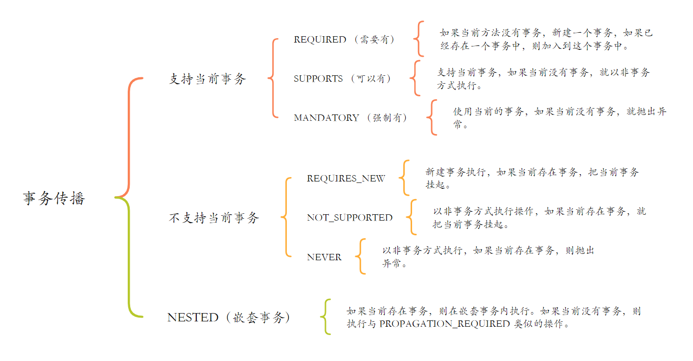

### Spring Bean的生命周期
1. 实例化：Spring 容器读取配置文件或注解，解析并加载 Bean 的定义信息到 BeanDefinition 中。
2. 设置 Bean 的属性（依赖注入）：根据 BeanDefinition 中的配置信息，对 Bean 的属性进行注入。
3. Aware 接口方法的调用：Spring 容器会调用相应的接口方法，将容器的相关资源传递给 Bean。
4. BeanPostProcessor 的前置处理
5. Bean 初始化
6. BeanPostProcessor 的后置处理
7. Bean 准备就绪
8. Bean 的销毁

### Bean的实例化和初始化区别
* 实例化：通过构造方法区创建一个对象实例
* Bean初始化：初始化是指在实例化之后对Bean进行配置和准备

### BeanDefinition的作用
用来描述一个Bean实例的元数据信息，描述信息中包含了该实例具有哪些属性、构造函数等信息。

### Spring创建Bean的方式
* 基于XML配置Bean
* 基于注解配置Bean：@Componse、@Service、@Controller、@Repository等
* @Configuration+@Bean
* FactoryBean实现Bean的注入
* @Import
* 通过Spring boot starter的方式，在resources下创建META-INF/spring.factories文件

### Spring用到了哪些设计模式
* 工厂模式：BeanFactory就是简单工厂模式的体现，用来创建对象的实例。
* 单例模式：Bean默认为单例模式。
* 代理模式：Spring的AOP用到了JDK的动态代理和CGLIB字节码生成技术。
* 模板方法：用来解决代码重复问题，比如RestTemplate、JmsTemplate、JpaTemplate、JdbcTemplate。
* 观察者模式：定义对象中的一种一对多的依赖关系，当一个对象的状态发生改变时，所有依赖于它的对象都会得到通知被动更新，比如Spring的Listener。

### Spring是如何实现事物的
通过@Transactional注解实现，当一个类或类中的方法存在此注解的修饰时，它会为该类创建一个代理对象，该代理对象负责事物的开始、提交和回滚，底层是通过JDK动态代理或CGLIB来实现的。

### Spring事物的传播机制有哪些
* REQUIRED(默认的事物传播级别)
* SUPPORTS
* MANDATORY
* REQUIRES_NEW
* NOT_SUPPORTED
* NERVER
* NESTED

### AOP有哪些通知类型
* 前置通知（Before Advice）
* 返回之后通知（After Returning Advice）
* 抛出（异常）后执行通知（After Throwing Advice）
* 后置通知（After Advice）
* 围绕通知（Around Advice）