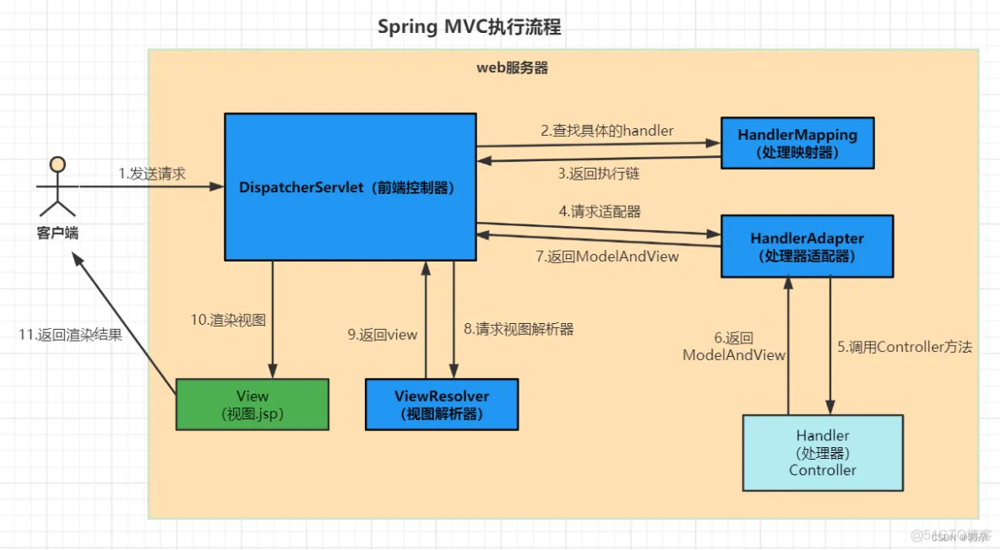

### GET和POST的区别（[参考](https://www.jianshu.com/p/55c8708da06c)）
* GET：浏览器回退无害、浏览器会主动缓存、仅支持URL编码、提交数据大小有限制、不安全参数暴露在URL上。
* POST：浏览器回退会再次提交请求、浏览器不会主动缓存、支持多种编码、POST理论上来说没有大小限制、比较安全可以传敏感信息、参数存在请求体中。

### Controller是否是线程安全的（[参考](https://blog.csdn.net/u012843361/article/details/84023869)）
非线程安全的，因为Spring创建的Bean默认是单例的。

### SpringMVC执行流程及工作原理（[参考](https://blog.51cto.com/u_15309887/5341042)）

