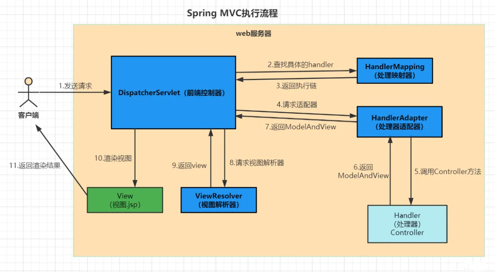

## 基础
### 多线程:star:
#### 实现多线程的几种方式
* 继承Thread类
* 实现Runnable接口
* 实现Callable接口通过Future包装器来创建Thread线程
* 通过线程池创建  

#### 线程的生命周期（或状态）
创建 ➔ 就绪 ➔ 运行 ➔ 阻塞 ➔ 终止

#### 并发的三大特性（线程安全必须满足）
* 原子性
* 可见性
* 有序性

#### start()和run()方法的区别
* 直接调用run()则相当于普通调用
* 调用start()后线程会被放到等待队列，然后通过JVM线程thread会调用run();

#### 乐观锁和悲观锁的区别
* 乐观锁：每次去拿数据的时候认为其他线程不会修改，所以不会上锁，但是在更新的时候会判断一下在此期间别的线程有没有去跟新这个数据（数据库增加version字段来实现乐观锁）
* 悲观锁：共享资源每次只给一个线程使用，其他线程阻塞，用完后再把资源让给其他线程；Java中的Synchronized就是悲观锁

#### sleep()和wait()方法的区别
* 相同：sleep()和wait()都会暂停当前线程并让出CPU
* 不同：
  * 定义位置：sleep()是线程类Thread的方法，wait()是顶级类Object的方法
  * 调用地方：sleep()可以在任何地方使用，wait()方法只能在`同步方法`和`同步块`中使用
  * 锁资源释放方式：sleep()不会释放锁，wait()会释放锁
  * 恢复方式不同：sleep()调用后停止运行期间仍持有同步锁，所以到时间会继续支持；wait()调用会放弃对象锁，进入等待队列，待调用notify()、notifyAll()唤醒指定的线程或所有线程

#### ThreadLocal的使用场景
ThreadLocal作用在每个线程内都需要独立的保存信息，这样就方便同一个线程的其他方法获取到该信息的场景，由于每一个线程获取到的信息可能都是不一样的，前面执行的方法保存了信息之后，后续的方法可以通过ThreadLocal可以获取到，避免了传参，类似于全局变量的概念

#### 多线程死锁
死锁是指多线程因竞争资源而造成的一种僵局（互相等待），若无外力作用，这些线程都将无法向前推进，解决方案：
* 线程之间交错执行，解决：以固定顺序枷锁
* 永久等待，解决：使用tryLock()定时锁，超过时限则返回错误信息

#### ThreadPoolExecutor线程池7大参数
* coolPoolSize：核心线程数
* maximumPoolSize：允许最大的线程数
* keepAliveTime：控线线程保留的时间
* unit：线程保留时间的单位
* BlockingQueue workQueue：阻塞队列（任务缓冲区）
* threadFactory：线程的构造工厂，主要用来创建线程
* handler：线程池饱和时候的处理策略

#### Executors工厂类提供的线程池有哪些
* newCachedTheThreadPool：`maximumPoolSize`为Integer.MAX_VALUE，适用：执行很多短期异步的小程序或者负载较轻的服务器
* newFixedThreadPool：允许的请求队列长度为Integer.MAX_VALUE，适用：执行长期的任务，性能好很多
* newSingleThreadPool：允许的请求队列长度为Integer.MAX_VALUE，适用：一个任务一个任务执行的场景
* newScheduledThreadPool：`maximumPoolSize`为Integer.MAX_VALUE,适用：周期性执行任务的场景

#### 什么是轻量级锁和重量级锁
* 轻量级锁：无实际竞争，多个线程交替使用锁，允许短时间的锁竞争
* 重量级锁：有实际竞争，且锁竞争时间长

#### Synchronized和Lock的区别
| 锁类型 | 性能 | 锁机制 | 编程 | 用法 |
| --- | --- | --- | --- | --- |
| Synchronized | 竞争不激烈的情况下，Synchronize比Lock性能好 | 在JVM层面实现的，系统会监控锁的释放与否 | 编程更简洁 | * 同步代码块；同步方法（包含静态方法）；修饰一个类synchronized(MyClass.class) |
| Lock         | 资源竞争激烈的情况下，Lock性能好 | JDK代码实现的，需要手动释放，在finally块中释放 | 功能更多更灵活，但是一定要在finally里面unlock()解锁才行 | 只能写在代码里，不能直接修改方法 |

#### 常见的锁有哪些
* Synchronized关键字：Java中最基本的锁机制，可以用来修饰方法或代码块
* ReentranLock：Lock锁的实现类，具有可重入性，允许一个线程多次获取同一个锁，而不会死锁
* Read/Write Locks（读写锁）：ReentrantReadWriteLock 是 Lock 的另一个实现，它允许多个线程同时读取共享资源，但只允许一个线程写入；

### JVM:star:


#### JVM 内存分哪几个区，每个区的作用是什么(内存模型):star:
* 方法区（`线程共享`）：有时候也称为永久代（Java8开始废弃永久代，改名为元空间MetaSpace），在该区内很少发生垃圾回收，但是并不代表不发生GC，在这里的GC主要是对方法区里的常量池和对类型的卸载；方法区主要用来存储已被虚拟机加载的类的信息、常量、静态变量和即时编译器编译后的代码等数据；方法区里有一个运行时常量池，用于存放静态编译产生的字面量和符号的引用。
* 栈（`线程私有`，生命周期和线程相同）：为Java方法服务，每个方法在执行的时候都会创建一个栈帧，用于存储局部变量表、操作数栈、动态链接和方法出口等信息。
* 本地方法栈（`线程私有`）：本地方法栈和虚拟机栈类似，只不过本地方发栈为Native方法服务。
* 堆（`线程共享`）：Java堆是所有线程所共享的一块内存，是Java虚拟机管理内存最大的一块区域，在虚拟机启动时创建，几乎所有的对象实例都在这里创建，因为该区域经常发生垃圾回收操作。
* 程序计数器（`线程私有`，也叫PC寄存器）：程序计数器是一块很小的内存空间，它可以看作是当前线程所执行的字节码行号指示器，记住下一条JVM指令的执行地址指向下一条要执行的指令，不会存在内存溢出（唯一没有OutOfMemoryError的区域）

#### 什么是类的加载
类的加载指的是将类的.class文件中的二进制数据读到内存中，将其放在运行时数据区的方法区内，然后在堆区创建一个java.lang.Class对象，用来封装类在方法区内的数据结构。

#### 常用参数
* -Xms 初始化堆空间大小
* -Xmx 最大堆空间大小
* -Xmn 年轻代空间大小
* -Xss 栈空间大小

#### JVM有哪些垃圾回收算法
* 标记清除：标记无用对象，然后进行清除回收；缺点：效率不高，无法清除垃圾碎片。
* 标记整理：标记无用对象，让所有存活的对象都向一端移动，然后直接清除掉端边界以外的内存。
* 复制：按照容量划分两个大小相等的内存区域，当一块用完的时候活着的对象复制到另一块上，然后把已使用的内存空间一次性清理掉；缺点：内存利用率低
* 分代算法：根据对象存活周期的不同将内存划分为几块，一般是新生代和老年代，新生代基本采用复制算法，老年代采用标记整理算法。

#### 什么是双亲委派模型
如果一个类加载器收到了类加载的请求，它首先不会自己去加载这个类，而是把这个请求委派给父类加载器去完成，只有当父加载无法完成加载请求（它的搜索范围中没找到所需的类）时，子加载器才会去尝试加载类。

#### 怎么判断对象是否可以被回收
* 引用计数器：为每个对象创建一个引用计数器，有对象引用时计数器+1，引用被释放时计数-1，当计数器为0时就可以被回收；缺点：不能解决循环引用的问题
* 可达性分析：从GC Roots开始向下搜索，搜索所走过的路径称为引用链；当一个对象到GC Roots没有任何引用链接时，则证明此对象是可以被回收的。

#### 累加载的过程
加载➔验证➔准备➔解析➔初始化➔使用➔卸载

### JVM调优

#### 常用的命令行性能监控和故障处理工具
* 操作系统工具
  * top：显示系统整体资源使用情况
  * netstat：监控网络使用情况
  * vmstat：监控内存和CPU
  * iostat：监控IO的使用
* JDK工具：
  * jps：显示所有Java进程PID及启动类信息
  * jstat：监控JVM运行时性能统计信息
  * jinfo：用于显示和调整JVM的配置信息
  * jmap：生成堆转储、显示堆内存详细信息
  * jhat：分析jmap生成的堆转储文件（被VisualVM取代）
  * jstack：生成线程的堆栈跟踪
  * jcmd：执行多种诊断命令
* 可视化的性能监控和故障处理工具：
  * JConsole：监控和管理 Java 应用程序
  * VisualVM：监控、分析、调试和配置 Java 应用程序
  * Java Mission Control：适合用于生产环境中的 Java 应用程序监控和分析
  * Arthas：Alibaba 开源的 Java 诊断工具，定位和解决生产环境中的 Java 应用程序问题

#### 线上服务CPU占用过高排查
* top列出各个进程的资源占用情况
* top -Hp 进程ID列出对应进程里面的线程占用资源的情况
* jstack PID 打印出进程的所有线程信息

#### 内存飚高问题排查
一般是因为创建了大量对象导致，持续飚高说明垃圾回收跟不上对象创建的速度，或者内存泄露导致对象无法回收。

### 集合

#### List

##### ArrayList和LinkedList、Vector的区别
* ArrayList：底层实现是数组；增删慢，查询快，非线程安全
* LinkedList：底层是一个双链表；增删快，查询慢，非线程安全
* Vector：和ArrayList类似，是一种老的动态数组，是线程同步的，效率很低，一般不赞成使用

#### Map:star:

##### HashMap与TreeMap、HashTable的区别及使用场景
* HashMap：非线程安全，基于哈希表实现，key和value都能为null；可以调优初始容量和负载因子。
* TreeMap：非线程安全，基于红黑树实现，key不能为null，value可以为null；所有的元素都是通过key值进行排序，速度慢。
* HashTable：线程安全，不允许空的键值，key和value都不能为null；和HashMap很相似。

##### HashMap数据结构，同样的key数据怎么处理，是怎么计算的
1. HashMap底层实现：数组+链表/红黑树，当链表长度大于8的时候会使用红黑树，链表长度低于6，就把红黑树转回链表。
2. Hash冲突：当两个不同的输入值，根据同一散列函数计算出相同的散列值的现象，我们就把它叫做哈希碰撞。

##### 如何解决哈希冲突
* 再哈希法
* 开放定址法
* 链地址法

##### 红黑树
红黑树是平衡二叉树的一种；二叉树，它的左子节点的值比父节点的值要小，右节点的值要比父节点的值大。

#### Set

##### HashSet、LinkedHashSet、TreeSet的区别
* HashSet：处理速度最快，无序；基于HashMap实现，允许为null；
* LinkedHashSet：处理速度其次，遵循插入顺序；基于LinkedList和HashSet实现（数组+链表+红黑树），允许为null；
* TreeSet： 插入元素时需要排序，所以速度较慢，遵循排序顺序；基于TreeMap实现，不允许为null；

### 设计模式

#### 单例模式
* 私有的构造函数
* volatile（禁止指令重排序）修饰的static单例对象
* 静态获取实例的方法（双重检测机制、同步锁）

#### 工厂模式
定义一个工厂类，根据传入的参数不同返回不同的实例，被创建的实例具有共同的父类或接口。

#### 适配器模式（通常用于解决接口不兼容问题）
* 类的适配器：通过继承目标类，实现扩展的接口类（该类包含目标类相同的方法）。
* 对象的适配器：适配器类不继承目标类，而是持有目标类对象。 
* 接口的适配器：一个接口中有很多方法需要实现，但是并不都是想要的，可以借助于一个抽象类，抽象类实现该接口实现所有方法，然后再写一个类继承抽象类实现需要的方法。
* 建造者模式：通过不同方法来创建复合对象。
* 观察者模式：观察者向主题发起订阅，当主题发生改变时，会通知观察者。

## 算法
1.排序：冒泡排序、选择排序、插入排序、归并排序；
2.搜索算法：二分查找；

## 框架

### Spring:star：

#### Spring Bean的生命周期
1. 实例化：Spring 容器读取配置文件或注解，解析并加载 Bean 的定义信息到 BeanDefinition 中。
2. 设置 Bean 的属性（依赖注入）：根据 BeanDefinition 中的配置信息，对 Bean 的属性进行注入。
3. Aware 接口方法的调用：Spring 容器会调用相应的接口方法，将容器的相关资源传递给 Bean。
4. BeanPostProcessor 的前置处理
5. Bean 初始化
6. BeanPostProcessor 的后置处理
7. Bean 准备就绪
8. Bean 的销毁

#### Bean的实例化和初始化区别
* 实例化：通过构造方法区创建一个对象实例
* Bean初始化：初始化是指在实例化之后对Bean进行配置和准备

#### BeanDefinition的作用
用来描述一个Bean实例的元数据信息，描述信息中包含了该实例具有哪些属性、构造函数等信息。

#### Spring创建Bean的方式
* 基于XML配置Bean
* 基于注解配置Bean：@Componse、@Service、@Controller、@Repository等
* @Configuration+@Bean
* FactoryBean实现Bean的注入
* @Import
* 通过Spring boot starter的方式，在resources下创建META-INF/spring.factories文件

#### Spring用到了哪些设计模式
* 工厂模式：BeanFactory就是简单工厂模式的体现，用来创建对象的实例。
* 单例模式：Bean默认为单例模式。
* 代理模式：Spring的AOP用到了JDK的动态代理和CGLIB字节码生成技术。
* 模板方法：用来解决代码重复问题，比如RestTemplate、JmsTemplate、JpaTemplate、JdbcTemplate。
* 观察者模式：定义对象中的一种一对多的依赖关系，当一个对象的状态发生改变时，所有依赖于它的对象都会得到通知被动更新，比如Spring的Listener。

#### Spring是如何实现事物的
通过@Transactional注解实现，当一个类或类中的方法存在此注解的修饰时，它会为该类创建一个代理对象，该代理对象负责事物的开始、提交和回滚，底层是通过JDK动态代理或CGLIB来实现的。

#### Spring事物的传播机制有哪些
* REQUIRED(默认的事物传播级别)
* SUPPORTS
* MANDATORY
* REQUIRES_NEW
* NOT_SUPPORTED
* NERVER
* NESTED


#### AOP有哪些通知类型
* 前置通知（Before Advice）
* 返回之后通知（After Returning Advice）
* 抛出（异常）后执行通知（After Throwing Advice）
* 后置通知（After Advice）
* 围绕通知（Around Advice）

### SpringMVC

#### GET和POST的区别
* GET：浏览器回退无害、浏览器会主动缓存、仅支持URL编码、提交数据大小有限制、不安全参数暴露在URL上。
* POST：浏览器回退会再次提交请求、浏览器不会主动缓存、支持多种编码、POST理论上来说没有大小限制、比较安全可以传敏感信息、参数存在请求体中。

#### Controller是否是线程安全的
非线程安全的，因为Spring创建的Bean默认是单例的。

#### SpringMVC执行流程及工作原理


### SpringBoot:star:

#### 为什么要使用SpringBoot
* 独立运行
* 简化配置
* 自动配置
* 上手容易

#### SpringBoot常用注解
* 核心注解：@SpringBootApplication
  * @EnableAutoConfiguration：启用SpringBoot的自动配置机制
  * @Configuration：允许在上下文中注册额外的Bean或导入其他配置类
  * @ComponentScan：扫描被@Component(@Service,@Controller)注解的Bean
* 配置文件值绑定注解：@ConfigurationProperties、@PropertySource、@Value

#### SpringBoot自动装配流程
* 先判断自动装配开关是否发开，默认spring.boot.enableautoconfiguration=true，可在application.properties或application.yml中设置。
* 读取EnableAutoConfiguration注解中的exclude和excludeName。
* 获取需要自动装配的所有配置类，读取META-INF/spring.factories。
* 通过@Conditional注解按需加载的不会所有的Bean都加载。

#### 如何去开发一个Starter
* Starter命名：spring-boot-starter-{name}。
* 引入依赖：spring-boot-starter、spring-boot-configuration-processor。
* 自定义配置类。、
* 在resource目录下创建META-INF/spring.factories文件，并将需要提供类的全路径写入。
* mvn package打包后就可以引入使用了。

#### 循环依赖，如何解决
* 构造函数注入：在构造函数中注入依赖项，而不是在属性中注入。
* Setter注入 ：使用setter方法注入依赖项，而不是在构造函数中注入。
* 延迟注入：使用@Lazy注解延迟加载依赖项。
* @Autowired注解的required属性：将required属性设置为false，以避免出现循环依赖问题。
* @DependsOn注解：使用@DependsOn注解指定依赖项的加载顺序，以避免出现循环依赖问题。

### SpringCloud:star:

## 分布式

### 分布式相关

#### 什么是分布式
将服务部署在多台机器上，分为水平扩展（同样的系统部署在多台机器上）和垂直拆分（一个系统拆分成若干个子系统，不同的子系统负责不同的服务）

#### 分布式和微服务有什么区别
* 分布式：分散压力，基于RPC协议调用
* 微服务：分散能力，可独立部署，基于HTTP协议调用

#### 分布式事物
两阶段提交、TCC(Try、Confirm、Cancel)

#### 分布式锁 

#### 如何设计一个高并发系统
* 系统拆分
* Cache（缓存）
* MQ消息队列（流量削峰、异步解耦）
* 数据库拆分（分库分表）
* 数据库读写分离
* ElasticSearch
* CDN加速

#### 如何实现负载均衡，有哪些算法可以实现
* 轮询
* 随机
* 源地址哈希
* 加权轮询
* 加权随机

#### 什么是CAP
指的是在一个分布式系统中，Consistency（一致性），Partition tolerance（分区容
错性），三者不可兼得。

#### 幂等防重

#### 柔性事物

#### 缓存最终一致性

## 数据库

### 事物:star

#### 事物的基本特性
* 原子性
* 一致性
* 隔离性
* 持久性

#### 事物的隔离级别
* 读未提交（Read Uncommitted）
* 读已提交（Read Committed）
* 可重复读（Repeatable Read）
* 串行化（Serializable）

#### 快速理解脏读、幻读、不可重复读
* 脏读：就是读取未提交数据，A事物读取B事物尚未提交的数据。
* 幻读：前后多次读取，数据总量不一致，主要针对insert和delete操作；A事物比较大，分为开始和结束，开始A统计了数量为100条，然后B事物来新增了100条数据，A事物再统计出来就是200条。
* 不可重复读：前后多次读取，数据内容不一致，主要针对update操作；A事物比较大前后读取不一致，B事物在开始修改了数据为100，在最后又改成了200，导致A事物读取前后不一致。

### MySQL:star:

#### 索引失效常见情况
* 索引列参与了运算
* 索引列使用了函数
* 隐式类型转换
* 两列作比较
* is null、is not null等
* or有可能也会导致索引失效
* 不等于、不小于、不大于、not in、not exist、between等范围查询
* 错误的like的使用，最左边不能出现占位
* 联合索引不满足最左匹配原则（指的是联合索引中，优先走最左边列的索引）

#### 表锁和行锁的区别
* 表锁：开销小，加锁快，不会出现死锁；锁的粒度大，发生锁冲突概率高，并发度最低。
* 行锁：开销大，加锁慢，会出现死锁；锁粒度小，发生锁冲突概率低，并发度高；行锁必须有索引才能实现，否则会自动锁全表。

#### limit 分页前几页很快，后续效率会变低，这是为什么？
前几页只需要扫描较少的索引页，但是随着页面的增加，需要扫描的索引页数量会增加，从而导致查询速度变慢。
优化方案：
```sql
select *from ad_keyword a JOIN (select id from ad_keyword  LIMIT 10000000,1000) b on a.id=b.id ;
```

#### MySQL存储引擎对比
* MySAM：成熟、稳定、易于管理、快速读取；不支持表级锁、事物等。
* InnoDB：空间占用大；支持事务、外键、数据行锁定等特性、有缓冲池；不支持全文索引。

#### 索引种类有哪些及类别
* 普通索引：仅加速查询
* 唯一索引：加速查询+列值唯一（可以有null）
* 主键索引：加速查询+列值唯一（不可以有null）
* 组合索引：多列值组成一个索引，专门用于组合搜索，其效率大于索引合并
* 全文索引：对文本的内容进行分词，进行搜索

#### 索引的数据结构，Hash索引与B+树索引的区别
* Hash索引不能进行范围查询，而B+树可以；
* Hash索引不支持联合索引的最左原则（即联合索引的部分索引无法使用），而B+树可以；
* Hash索引不支持Order By排序，而B+树支持；
* Hash索引无法进行模糊查询，而B+树使用like进行模糊查询的时候，like后面左模糊查询可以起到优化的作用；
* Hash索引在等值查询上比B+树效率更高；

#### B树索引和B+树索引的区别
B树索引每个节点包含键值和对应的数据，B+树中，所有数据存储在叶子节点，非叶子节点只包含键值和指向下层节点的指针。

#### explain的结果type速度排行
system > const > eq_ref > ref > fulltext > ref_or_null > index_merge > unique_subquery > index_subquery > range > index > ALL

#### SQL查询慢优化步骤
1. 通过日志查询出来执行慢的SQL
2. explain执行计划查看SQL是否走索引
3. 判断字段查询是否适合走索引，是否是索引失效

#### 如何判断该索引是否适合建
通过`show index from 表名`查询所有索引，结果里面有个关键字叫Cardinality，这个值除以数据的总行数的值越接近1就代表越适合建索引，否则如果数值过小则需要考虑是否有建索引的必要。

#### 什么是聚簇索引和非聚簇索引
* 聚簇索引：将数据存储和索引放到了一块，找了了索引也就找到了数据；表数据按照索引顺序来存储的，也就是说索引项的顺序与表中记录的物理顺序一致。、
* 非聚簇索引：将数据存储与索引分开，叶节点包含索引字段值及指向数据页数据行的逻辑指针，其行数量与数据表行数量一致。

#### 回表的概念
使用非聚簇索引进行查询是，如果查询到非索引字段则需要通过指向数据行的逻辑指针再去查一遍。

#### MySQL的执行流程

## 中间件

### RabbitMQ

#### RabbitMQ消息传播方式
* Simple Work Queue（简单工作队列）：也就是常说的点对点模式，一条消息由一个消费者进行消费；
* Work Queues（工作队列）：也叫公平队列，能者多劳的消息队列模型；队列必须接收来自消费者的手动ack才可以继续往消费者发送消息。
* Publish/Subscribe（发布订阅模式）：一条消息被多个消费者消费；
* Routing（路由模式）：有选择的接收消息；
* Topics（主题模式）：通过一定的规则来选择性的接收消息；
* RPC模式：发布者发布消息，并且通过RPC方式等待结果；

#### 如何保证数据的可靠性，保证数据不丢失
* 开启事物（不推荐）
* 开启confirm（推荐）
* 开启RabbitMQ持久化（交换机、队列、消息）
* 关闭RabbitMQ的自动ack（改成手动）

#### 如何解决消息积压的问题
* 生产者减少发布频率；
* 修复消费者的问题故障，保证其原有的消费能力；
* 增加消费者的处理能力，用多线程去处理；
* 消费者增加实例；

#### 如何防止消息被重复消费
互斥锁

### Kafka

### Redis:star:

#### Redis 有哪些数据类型
* String(字符串)
* List(列表)
* Hash(哈希)
* Set(集合)
* ZSet(有序集合)

####  Redis是单线程还是多线程
网络IO和键值对读写是由一个线程来完成的，Redis6开始支持多线程是从单线程处理网络请求到多线程处理，多线程机制默认是关闭的。

#### Redis集群有几种模式
* 主从模式
* 哨兵（Sentinel）模式
* 集群（Cluster）模式

#### Redis与MySQL双写一致性如何保证

#### 什么是缓存穿透、击穿和雪崩
* 缓存穿透：访问的数据既不在缓存也不在数据库，解决方案:
  * 非法请求的控制
  * 缓存空对象；缺点：可能会缓存很多的空对象，占用内存空间；缓存空对象后设置过期时间；缺点：可能会导致数据库和Redis中在某个时间段的数据不一致。
  * 布隆过滤器：可用于判断一个元素是否在一个集合中，查询效率很高，节省内存空间。
* 缓存击穿：当某个数据被高并发访问时，如果某一个热点数据的缓存突然失效，会导致这些请求在同一时间打到数据库，数据库扛不住就会导致系统瘫痪，解决方案：
  * 热点数据不过期，但是会导致数据和数据库数据不一致，可以后台更新缓存（相关中间件监控数据变化并同时更新缓存）。
  * 使用互斥锁（分布式锁），保证同一时刻只能有一个查询请求重新加载热点数据到缓存中，其他的线程只需等待该线程运行完毕，即可重新从Redis中获取数据。
* 缓存雪崩
  * 大量缓存同时过期
    * key失效时间设置随机，避免在同一时间过期；
    * 互斥锁，保证同一时间内只有一个请求在构建缓存；
    * 双key策略，主key设置过期时间，备key永久，主key过期时返回备key内容；
  * Redis故障宕机
    * 服务熔断
    * 请求限流
    * 构建Redis高可用集群

## 云原生


